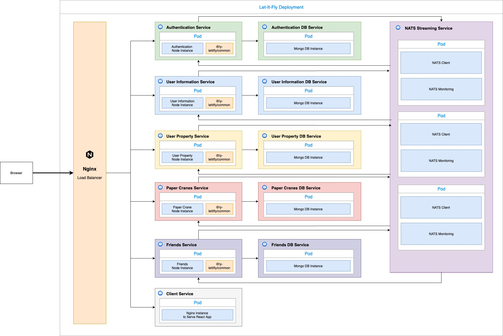

## Why Event-Driven Microservices?

> Author: Jimmy Lan
>
> Date: 2020-12-09

### Event-Driven Microservices

This project is written based on the [Event-Driven Microservices Architecture](https://medium.com/trendyol-tech/event-driven-microservice-architecture-91f80ceaa21e). As you can see from the service overview image, we have multiple containers running different instances of node.js and database services across our deployment cluster.

We chose [NATS Streaming Server](https://docs.nats.io/nats-streaming-concepts/intro) as our messaging platform. Note that we didn't need to choose NATS specifically, and there are many other messaging services as alternatives. For instances, [Rabbit MQ](https://www.rabbitmq.com/) and [Cloud Pub/Sub](https://cloud.google.com/pubsub/docs).
We chose NATS because there are plenty of good resources and example use of it online, it has a good documentation site, and it has a unique concept of "queue groups" which we particularly like.

Also, we want to outline the flexibility of our system. One can substitute any node.js instances to an instance written by other languages, such as Java or Python. One can also substitute a database instance to, for example, Postgres SQL or Redis without a problem. Our system design gives enough flexibility to allow expansion, and it is part of the reasons that we chose to use an event-driven microservices design, which we will talk about in the next section.

### Why Event-Driven Microservices

You may be tempting to ask why we wrote our project this way instead of the approach taught by CSC309. That's a fair question to ask, and I will answer this question from several dimensions in this article.

_I will present my personal opinions in this section, so please excuse me from using "I" instead of "we" in the following text._

#### To Explore

Microservices are very popular these days, and the "traditional" approach of creating microservices had many downsides to it (such as "service calling chain", causing lots of services to fail when one of them fails). Event-driven microservices, as a variation of microservices architectures, seems to be a great solution to many of the issues. There's no better way of exploring this topic other than trying it out myself!

#### To Expand

By using the microservices architecture, expanding this project becomes much easier. As the services are loosely coupled in the event-driven approach, different developers can work on different services at the same time without too much interference of each other. Also, we can freely adjust the number of pods that run a particular service based on load. For example, if we find that the load of requests to the paper crane service is much higher compared to other services, we can simply go to the infra folder and add more pods running the paper crane service. We obviously do not have to scale the entire app to accommodate this traffic. Additionally, our services can scale horizontally so that they are not bounded by the maximum machine power.

As we know, a single tier server will have no choice but to vertically scale the whole application even if most of the load comes from only a part of that application. Besides, when a portion of the application changes, using a single tier instance would require the packaging and deployment of the entire application, which can be troublesome for developers.

#### To Challenge

For the purpose of this course, and maybe for the scope of this application, you might say that a microservices architecture is not really needed. I agree. However, I think the purpose of programming is to challenge and innovate new things. Only seeing and understanding a concept is very different from actually writing an implementation of that concept. I grow by trying new things and implementing interesting ideas. This course seems to be a very good opportunity to innovate and challenge myself. If not now, when?

In our group, we have 1 student with some experience in web development (i.e. that's me), and 3 other students with no knowledge of web development coming into this course. So we thought, maybe we should do a bit more than other groups to make it fair for groups with all 4 students having zero experience in web development. Also, wiring up the services and handling concurrency and messaging is hard, but if you look at individual services, they are well-structured and not difficult to understand. It might be much easier for students with no experience in web development in our group to focus on some particular service working with only one area of functionalities, instead of having them to look at a huge service combining all functionalities together.

Finally, we want to see how above & beyond we can make this project become. We are happy we successfully implemented a working event-driven microservices architecture in the end.

#### How About the Cost?

The cost of running a microservices cluster is not significantly higher than running a single instance. In Google Kubernetes Engine, we can configure auto scaling of nodes which can automatically bring the number of nodes down to 0 when needed.

For the purpose of this project, we will not configure our cluster this way. We will always ensure that we have 3 nodes available. Even so, running the cluster costs less than CAD\$60.00 per month at the time of writing.
