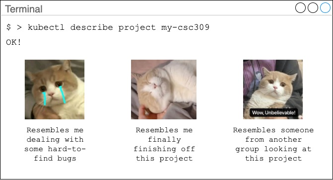

## Brief Marking Guide for Phase 2

> Author: Jimmy Lan
>
> Date: 2020-12-11

Thank you for still being with us during this difficult time.

We are happy to inform you that we took a challenge to create distributed backend services for this project, and managed to successfully complete this challenging task. However, unfortunately, we would also like to inform you that most of the integration of backend and frontend were not completed, although the front-end and backend by themselves are fully functional. We didn't end up with enough time for integration, and hopefully we can push it for future development.

For this project, we would like to ask you to look at the backend separately first, before you move on to the actual (half-done integration) site. The deployed site is missing the reply feature, which is implemented on the backend. It is also missing a feature to view other people's profile. The store features were not fully integrated, too.

However, these services were complete and well-tested on the backend. Please read [List of Endpoints](/docs/backend/endpoints.md) for a list of routes. In our application, there are three types of users: guest, admin, and regular user. The definition of regular user and admin is hopefully trivial. We added a guest user type so that when the users first signs up to our site, we can show them so tutorials and ask for their first and last name. The user can only access other services after they enter their first and last name, as we described in [List of Endpoints](/docs/backend/endpoints.md).

You may be tempted to ask why we chose a micro-services architecture. Please read: [Why Event-Driven Microservices](/docs/backend/why-edm.md). You can also find an overview of our system at [System Overview](/docs/backend/overview.md).

You may wonder why we did not have time to finish off the integration between backend and frontend, when this task seems to be much, much easier than creating a microservices architecture and handling a bunch of concurrency issues. This is because one of our team members got too excited writing the services so that unfortunately, he felt very tired during the last a few days and was lacking sleep. This was an unexpected event, and so the productivity dropped by a bit.

We apologize for not being able to present the project in full to you, despite that we have all the exciting features. You can visit our deployed site at https://letitfly.net.

Finally, please allow me to run the last command for this project. It's about microservices, of course!

May the spirit of programming and innovation be with the people who deserve, and so creativity never stops.

Thank you for grading our project. This awesome project would not
be possible without your help.

Jimmy Lan
